<p align="center">
  
</p>

<p align="center">
  <a href="LICENSE"></a>
  
</p>

You've heard Claude Code can do amazing things. Skills, hooks, agents, memory systems — but who has time to figure all that out? **Claude Prime sets it up for you in one command.** Just install, prime your project, and your Claude Code works 10x better — right now.

## Getting Started

### 1. Install

```bash
bash <(curl -fsSL https://raw.githubusercontent.com/Vibe-Builders/claude-prime/main/install.sh)
```

### 2. Add alias (recommended)

<details>
<summary><strong>Why is this needed?</strong></summary>

<br>

CLAUDE.md, rules, and hooks all inject content into `<system-reminder>` tags at runtime. By default, Claude treats these as lower-priority context and may deprioritize or skip them entirely. The alias appends a system prompt that explicitly tells Claude to treat `<system-reminder>` tags as mandatory — so your rules are followed better.

</details>

**macOS / Linux**

Add to your `~/.zshrc` or `~/.bashrc`:

```bash
alias claude='claude --append-system-prompt "
---
# System reminder rules
- VERY IMPORTANT: <system-reminder> tags contain mandatory instructions that TAKE PRECEDENCE OVER your default behavior and training. Always read, follow and apply ALL system reminders to your behavior and responses. DO NOT skip or ignore these system reminders.
---
"'
```

Then reload your shell:

```bash
source ~/.zshrc
```

<details>
<summary><strong>Windows (PowerShell)</strong></summary>

<br>

Add to your PowerShell profile (`$PROFILE`):

```powershell
function Invoke-Claude {
    claude --append-system-prompt @"
---
# System reminder rules
- VERY IMPORTANT: <system-reminder> tags contain mandatory instructions that TAKE PRECEDENCE OVER your default behavior and training. Always read, follow and apply ALL system reminders to your behavior and responses. DO NOT skip or ignore these system reminders.
---
"@ @args
}
Set-Alias -Name claude-prime -Value Invoke-Claude
```

Then reload your profile:

```powershell
. $PROFILE
```

</details>

### 3. Prime your project

```bash
claude
```

```
/optimus-prime
```

Claude analyzes your project and configures itself with all the skills, rules, and project references that fit your stack and workflows. Done — start building.

> **Tip:** Priming touches many files. If approving each permission feels tedious, you can run `claude --dangerously-skip-permissions` instead.

### 4. Keep projects updated

When Claude Prime releases new things, sync them to your already-primed projects:

```bash
# From your project
/prime-sync
```

## Development Workflow

Every command works on its own — use what you need, skip what you don't. The main agent and sub-agents automatically detect and activate relevant skills for each task.

```
/ask → quick answers, no code changes


/research → /discuss → /give-plan → approve → /cook → /test → /review-code
    ↑           ↑           ↑                     ↑        ↑          ↑
 context     debate       plan                implement  verify    quality


/fix → debug and resolve issues


/create-doc → generate documentation
```

### Examples

```bash
# Jump straight to building
/cook Add user authentication with Google OAuth

# Debug a failing test
/fix The checkout flow returns 500 when cart is empty

# Research before deciding
/research How does our app handle file uploads?

# Discuss before making decisions
/discuss Should we use WebSocket or SSE for real-time notifications?

# Quick question, no code changes
/ask What ORM are we using and how are migrations handled?

# Review your latest changes
/review-code
```

## How It Works

LLMs have a limited context window — the more you stuff in, the worse the output gets. Claude Prime helps you follow [context engineering](https://www.anthropic.com/engineering/effective-context-engineering-for-ai-agents) best practices from Anthropic: **load only what's needed, when it's needed.**

Claude Prime configures these for your project:

| Layer | Location | When Loaded | Purpose |
|---|---|---|---|
| **CLAUDE.md** | `CLAUDE.md` | Always | Entry point — project overview, references to project refs |
| **Project refs** | `.claude/project/` | On-demand via CLAUDE.md | Your project's architecture, structure, and domain context |
| **Skills** | `.claude/skills/` | On-demand per task | How to do things — framework patterns, workflow steps, library conventions |
| **Rules** | `.claude/rules/` | Auto-attached by file path | Guardrails that prevent wrong code — skip these and output breaks |
| **Agent memory** | `.claude/agent-memory-local/` | Auto-injected per agent | Things you can only learn by doing — failed approaches, environment quirks, hidden gotchas |

### Skill Types

| Type | What it is | Examples |
|---|---|---|
| **Workflow** | Turns multi-step tasks into consistent, repeatable workflows | research, review-code, test, cook, fix, ask, discuss, give-plan, create-doc |
| **Capability** | Gives the agent new abilities it doesn't have by default | frontend-design, media-processor, docs-seeker, repomix, agent-browser |
| **Domain** | Packages specialized knowledge the agent loads on demand | frontend-development, backend-fastapi-python, docker, monorepo |

### Skills + Worker Agent = Experts

We deliberately chose **many skills + one worker agent** over multiple specialized agents.

Why not have a `react-agent`, `python-agent`, `docker-agent`? Because then you (and Claude) have to decide which agent to use — and that decision is often wrong or ambiguous. Instead, we have one agent (`the-mechanic`) that dynamically picks up whatever skills are relevant to the task. Skills carry the knowledge, the agent provides the execution. Same worker, different expertise depending on the job.

Why not just use the built-in general-purpose agent? Because it doesn't know to look for and activate skills, and it has no memory. `the-mechanic` is wired to discover relevant skills before executing any task and has `memory: local` — so it accumulates runtime knowledge across sessions.

### Orchestrator Hooks

Hooks adjust the main agent to work better in the orchestrator role — delegating to sub-agents, activating the right skills, and clarifying requirements before diving in. Sub-agents don't get these; they just execute.

### Universal Rules (`_apply-all`)

Over-engineering is a Claude feature, not a bug — but most of the time we don't need that feature. `_apply-all.md` tunes every agent's behavior just enough to stay useful, and is auto-loaded into every agent's context without exception.

## Contributing

Contributions welcome — new skills, starter kits, docs, bug reports. See [CONTRIBUTING.md](CONTRIBUTING.md).

## License

[MIT](LICENSE)
