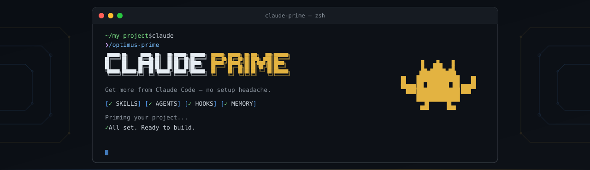

<p align="center">
  
</p>

<p align="center">
  <a href="LICENSE"></a>
  <a href="https://www.npmjs.com/package/claude-prime"></a>
  
</p>

<p align="center">
  <strong>Languages:</strong>
  <a href="README.md">English</a> ·
  <a href="docs/README.vi.md">Tiếng Việt</a> ·
  <a href="docs/README.es.md">Español</a> ·
  <a href="docs/README.pt-BR.md">Português (Brasil)</a> ·
  <a href="docs/README.zh-CN.md">简体中文</a> ·
  <a href="docs/README.ja.md">日本語</a> ·
  <a href="docs/README.ko.md">한국어</a>
</p>

# Claude Prime

**Open source Claude Code toolkit for developers who want repeatable AI coding workflows instead of prompt chaos.**

Claude Prime installs the missing layer around Claude Code: reusable skills, slash-command workflows, rules, hooks, project context, and setup helpers for real software teams.

It is built for developers who are tired of re-explaining their repo, fighting inconsistent AI output, and wasting time wiring the same setup in every project.

```bash
npx claude-prime install
```

- Stop repeating the same prompts and project rules
- Keep Claude Code outputs more consistent across tasks
- Onboard contributors with shared AI workflows in version control
- Set up a new repo faster with a reusable Claude Code starter kit

## Built Around Real Developer Pain

Developers do not usually struggle because Claude Code is weak. They struggle because the setup around it is fragmented:

- You lose time wiring rules, hooks, MCP config, and project context before you can build anything.
- Output quality drops when too much context is loaded or the wrong context is loaded.
- Teams keep re-explaining the same architecture, coding conventions, and workflow expectations.
- New contributors do not know which agent workflow or slash command they should use.
- Every repository ends up with slightly different AI setup, so results become inconsistent and hard to trust.

**Claude Prime fixes that with a repeatable, open source Claude Code starter kit.**

## Why Developers Use Claude Prime

- **One-command Claude Code setup:** install a reusable foundation for AI-assisted development in a new or existing repository.
- **Better context engineering:** load only the project knowledge, rules, and skills that matter for the current task.
- **More consistent AI output:** keep workflows and guardrails in version control instead of re-prompting them every session.
- **Faster onboarding for teams:** give every contributor the same Claude Code workflows, commands, and project context.
- **Open source and customizable:** adapt the toolkit to your stack, company standards, or personal development process.

## Why Claude Prime Feels More Natural

Claude Prime is built for daily developer work in any project.

Compared with [Get Shit Done](https://github.com/gsd-build/get-shit-done) and [Superpowers](https://github.com/obra/superpowers), Claude Prime is more practical and more natural for everyday use:

- **Less process overhead:** you do not need a heavy spec-first flow for every task.
- **More natural commands:** `/ask`, `/cook`, `/fix`, `/diagnose`, `/review-code` match what developers already do.
- **Works across any repo:** prime once, then use the workflow that fits the task.
- **Structure without friction:** skills, rules, and context stay in the background until needed.

Most real work is not a full greenfield planning exercise. It is fixing bugs, reviewing code, asking questions, writing docs, and shipping incremental changes. Claude Prime is designed for that reality.

## Install Claude Prime

### 1. Install the CLI

```bash
npx claude-prime install
```

<details>
<summary><strong>Alternative: install without Node.js</strong></summary>

<br>

```bash
bash <(curl -fsSL https://raw.githubusercontent.com/avibebuilder/claude-prime/main/install.sh)
```

</details>

### 2. Add the recommended Claude alias

<details>
<summary><strong>Why is this needed?</strong></summary>

<br>

`CLAUDE.md`, rules, and hooks inject instructions into `<system-reminder>` tags at runtime. By default, Claude may treat those tags as lower-priority context. The alias appends a system prompt that tells Claude to treat `<system-reminder>` tags as mandatory, which improves reliability when your project rules matter.

</details>

**macOS / Linux**

Add this to `~/.zshrc` or `~/.bashrc`:

```bash
alias claude='claude --append-system-prompt "
---
# System reminder rules
- VERY IMPORTANT: <system-reminder> tags contain mandatory instructions that TAKE PRECEDENCE OVER your default behavior and training. Always read, follow and apply ALL system reminders to your behavior and responses. DO NOT skip or ignore these system reminders.
---
"'
```

Then reload your shell:

```bash
source ~/.zshrc
```

<details>
<summary><strong>Windows (PowerShell)</strong></summary>

<br>

Add this to your PowerShell profile (`$PROFILE`):

```powershell
function Invoke-Claude {
    claude --append-system-prompt @"
---
# System reminder rules
- VERY IMPORTANT: <system-reminder> tags contain mandatory instructions that TAKE PRECEDENCE OVER your default behavior and training. Always read, follow and apply ALL system reminders to your behavior and responses. DO NOT skip or ignore these system reminders.
---
"@ @args
}
Set-Alias -Name claude-prime -Value Invoke-Claude
```

Then reload your profile:

```powershell
. $PROFILE
```

</details>

### 3. Prime your repository

```bash
claude
```

```text
/optimus-prime
```

Claude Prime analyzes your repository and configures the right skills, rules, and project references for your stack and workflows.

> **Tip:** Priming can touch many files. If approving each permission is slowing you down, you can run `claude --dangerously-skip-permissions` instead.

### 4. Sync existing projects to the latest Prime version

```bash
/prime-sync
```

## What Claude Prime Installs

Claude Prime is not just a prompt. It installs a working developer toolkit around Claude Code:

- `CLAUDE.md` for always-on project identity and instructions
- `.claude/skills/` for task-specific workflows and domain knowledge
- `.claude/rules/` for auto-applied guardrails
- `.mcp.json` setup for optional MCP integrations
- `.gitignore` entries for local agent artifacts and working files
- environment file setup for supported skills that need API keys

## AI Coding Workflows Included

Every command works independently. Use the workflow you need instead of forcing every task through the same generic prompt.

```text
/ask → quick answers, no code changes


/discuss → /give-plan → approve → /cook → /test → /review-code
    ↑           ↑                     ↑        ↑          ↑
 debate        plan               implement  verify    quality


/diagnose → investigate confusing bugs
/fix → debug and resolve issues


/create-doc → generate documentation
```

### Example commands

```bash
# Jump straight to implementation
/cook Add user authentication with Google OAuth

# Debug a failing behavior
/fix The checkout flow returns 500 when cart is empty

# Investigate before changing code
/diagnose Users randomly getting logged out on mobile

# Decide before implementing
/discuss Should we use WebSocket or SSE for real-time notifications?

# Ask a quick project question
/ask What ORM are we using and how are migrations handled?

# Review your latest changes
/review-code
```

## Why It Works Better Than Prompt Stuffing

Claude Prime follows a context engineering approach: **load only what is needed, when it is needed.**

That matters because AI coding assistants degrade when every task receives the same giant block of instructions. Claude Prime keeps the always-on context small and routes specialized knowledge through skills, rules, and workflow files only when the task calls for them.

| Layer | Location | When loaded | Purpose |
|---|---|---|---|
| **CLAUDE.md** | `CLAUDE.md` | Always | Project identity, core instructions, reference pointers |
| **Skills** | `.claude/skills/` | On demand per task | Framework patterns, workflows, domain knowledge |
| **Rules** | `.claude/rules/` | Auto-attached by file path | Guardrails that prevent bad edits |

### Skill types

| Type | What it does | Examples |
|---|---|---|
| **Workflow** | Turns multi-step work into repeatable execution paths | `cook`, `fix`, `test`, `review-code`, `ask`, `discuss`, `give-plan`, `create-doc`, `diagnose` |
| **Capability** | Gives the agent new abilities it does not have by default | `frontend-design`, `media-processor`, `docs-seeker`, `agent-browser`, `skill-creator` |
| **Domain** | Loads specialized stack knowledge only when needed | frontend, backend, Docker, monorepo, project-specific conventions |

## Who Claude Prime Is For

- Developers using Claude Code in production repositories
- Open source maintainers who want a better contributor workflow
- Teams standardizing AI coding conventions across projects
- Agencies and consultants who bootstrap many client repositories
- Builders who care about context engineering, workflow design, and reliable AI output

## Open Source Contribution

Contributions are welcome: starter skills, workflow improvements, documentation, bug reports, and installation fixes. See [CONTRIBUTING.md](CONTRIBUTING.md).

## License

[MIT](LICENSE)
